# Respostas

### 1- Qual o endereço do seu notebook (colab) executado? Use o botão de compartilhamento do colab para obter uma url.
 - https://github.com/Dhonrian/pos_ifnet/blob/main/25E2_2/Question%C3%A1rio_Projeto_de_Disciplina_de_Text_Mining.ipynb

### 2 - Em qual célula está o código que realiza o download dos pacotes necessários para tokenização e stemming usando nltk?
 - Está localizado na **célula 7** do notebook.
 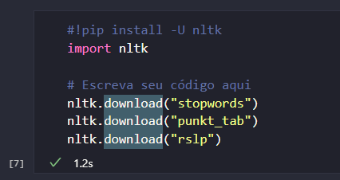

### 3 - Em qual célula está o código que atualiza o spacy e instala o pacote pt_core_news_lg?
 - Está localizado na **célula 5** do notebook.
 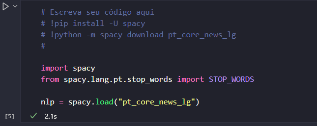

### 4 - Em qual célula está o download dos dados diretamente do kaggle?
 - Está localizado na **célula 3** no começo do notebook.    
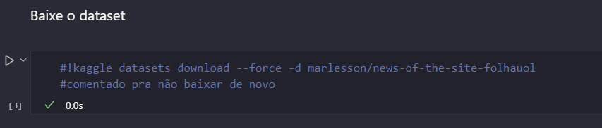

### 5 - Em qual célula está a criação do dataframe news_2016 (com examente 7943 notícias)?
 - Está na **célula 9**
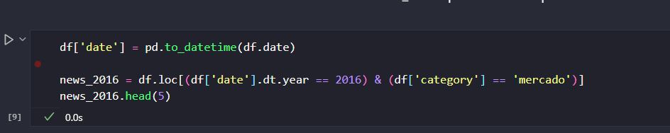

### 6 - Em qual célula está a função que tokeniza e realiza o stemming dos textos usando funções do nltk?
 - **A célula 10** do notebook.
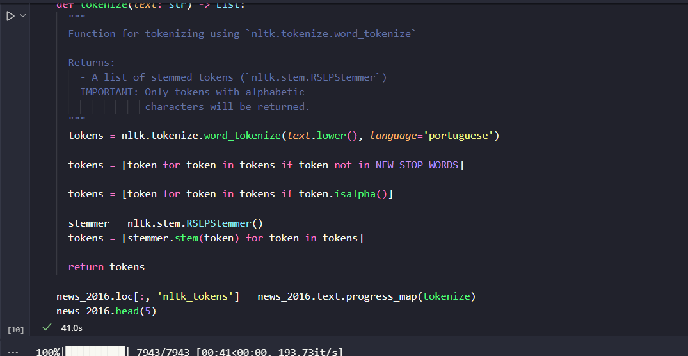

### 7 - Em qual célula está a função que realiza a lematização usando o spacy?
 - A lematização é realizada na **célula 12**.
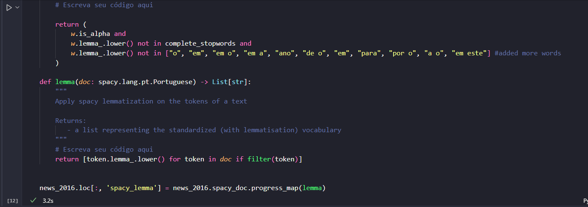

### 8 - Baseado nos resultados qual a diferença entre stemming e lematização, qual a diferença entre os dois procedimentos? Escolha quatro palavras para exemplificar.
 - A diferença entre os procedimentos é que enquanto o stemming diminui a palavra para o radical sem levar em conta o contexto ou significado, a lematização deixa a palavra em sua forma original considerando o contexto. O stemming pode gerar palavras que são dificeis de reconhecer o que não ocorre na lematização.
 
    Alguns casos que ocorrem no dataset:

    | original | stemming | lematização |
    | --- | --- | --- |
    | projeto, projetar | projet | projeto |
    | primeiro, primeiras | primeir | primeiro |
    | mercado, mercadinho | mercad | mercado |
    | diversão, diversões | divers | diversão |

### 9 - Em qual célula o modelo pt_core_news_lg está sendo carregado? Todos os textos do dataframe precisam ser analisados usando os modelos carregados. Em qual célula isso foi feito?
 - O modelo pt_core_news_lg é carregado na **célula 5** e os textos são analisados na **célula 10**.

### 10 - Indique a célula onde as entidades dos textos foram extraídas. Estamos interessados apenas nas organizações.
 - As entidades dos textos foram extraídas na **célula 13**.
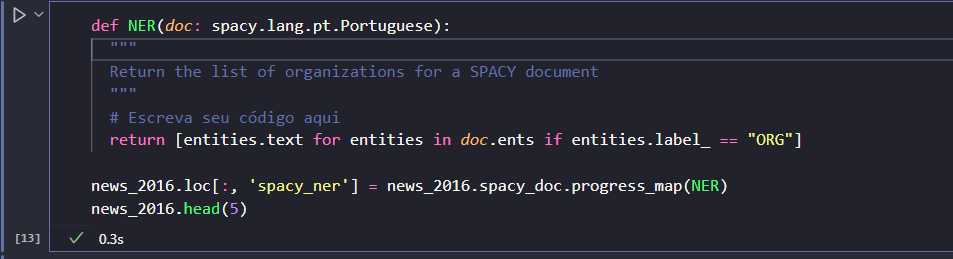

### 11 - Cole a figura gerada que mostra a nuvem de entidades para cada tópico obtido (no final do notebook) 
 - 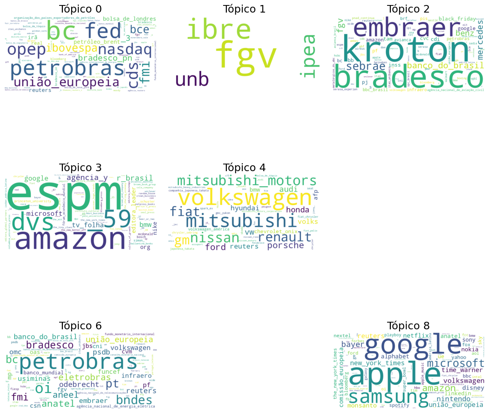

### 12 - Quando adotamos uma estratégia frequentista para converter textos em vetores, podemos fazê-lo de diferentes maneiras. Mostramos em aula as codificações One-Hot, TF e TF-IDF. Explique a principal motivação em adotar TF-IDF frente as duas outras opções.
 - A principal motivação em adotar o TFIDF em comparação com as outras duas opções é que ele mede a frequência de um termo em todo o corpus, diferente do TF que mede apenas no documento. Isso quer dizer que termos que aparecem em vários documentos não terão tanto peso, enquanto os mais raros ganham mais importância. O One-Hot apenas considera se o termo existe ou não, o que além de aumentar o número de dimensões não traz informações sobre a importância do termo.

### 13 - Indique a célula onde está a função que cria o vetor de TF-IDF para cada texto. 
 - A função que cria o vetor de TF-IDF está na **célula 14**. 
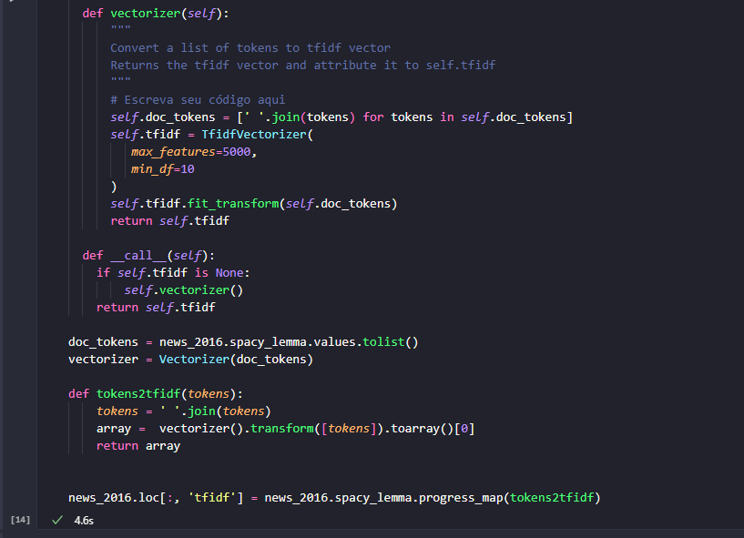

### 14 - Indique a célula onde estão sendo extraídos os tópicos usando o algoritmo de LDA.
 - Os tópicos estão sendo extraídos na **célula 16**.
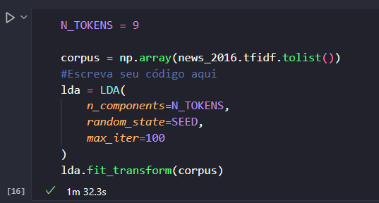

### 16 - Cole a figura com a nuvem de palavras para cada um dos 9 tópicos criados.
- 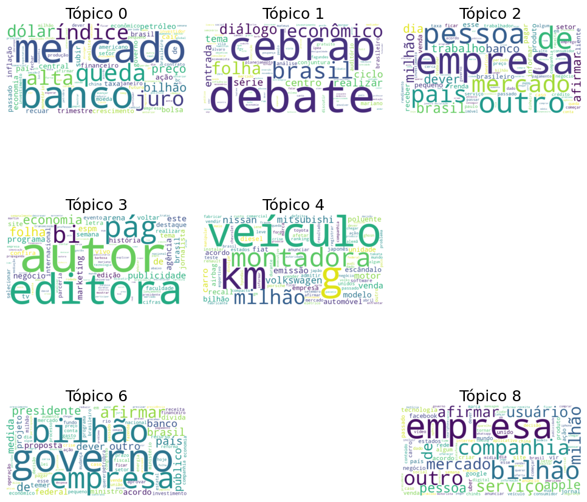

### 17 - Escreva brevemente uma descrição para cada tópico extraído. Indique se você considera o tópico extraído semanticamente consistente ou não. 
- O **Tópico 0**: mostra palavras relacionadas a banco, mercado, queda, dólar. O que parece indicar ser sobre  notícias sobre ações ou economia. Se tratando de um tópico consistente.
- O **Tópico 1** possui palavras do mesmo contexto que remetem a notícias políticas, como: debate, diálogo, tema. Bem como alguns institutos como fgv, cebrap. 
- O **Tópico 2** também tem palavras relacionadas a mercado mas com um foco empresarial com palavras como: empresa, milhão, trabalho. 
- O **Tópico 3** é um tópico voltado para jornalismo ou comunicação mostrando palavras como: autor, editora, pág, folha.
- O **Tópico 4** traz várias palavras relacionadas a notícias ao setor de veículos, como: veículo, montadora, km, modelo. Bem como algumas marcas como: nissa, volkswagen, mitsubishi.
- O **Tópico 6** tem notícias relacionadas à gestão atual do país, palavras mais comuns são: governo, presidente, proposta, medida, projeto.
- O **Tópico 8** é o último tópico e aparenta ser sobre notícias de empresas de tecnologia já que mostra palavras como: empresa, bilhão, serviço, facebook, google. 

No geral todos os tópicos mostram uma consistências entre os tópicos extraídos.

### 18 - Neste projeto, usamos TF-IDF para gerar os vetores que servem de entrada para o algoritmo de LDA. Quais seriam os passos para gerar vetores baseados na técnica de Doc2Vec?
- O doc2vec é semelhante ao word2vec mas que ao invés de gerar um vetor para cada palavra, gera um vetor para cada documento do corpus. Os passos são semelhantes para gerar os vetores, mas o doc2vec expande o conceito do word2vec ao considerar o contexto de cada palavra em relação ao documento.
Os passos começam semelhantes com stemming e lematização, entretanto o doc2vec utiliza uma "tag" que representa o documento permitindo que o modelo aprenda a associar as palavras com o documento. 
Os passos são:
1 - Pré-processamento com stemming e lematização.
2 - Criação de tags para cada documento.
3 - Treinamento de um modelo.

### 19 - Em uma versão alternativa desse projeto, optamos por utilizar o algoritmo de K-Médias para gerar os clusters (tópicos). Qual das abordagens (TF-IDF ou Doc2Vec) seria mais adequada como processo de vetorização? Justifique com comentários sobre dimensionalidade e relação semântica entre documentos.
- Levando em consideração a dimensionalidade e a relação semântica, o doc2vec seria mais adequado. O TFIDF gera vetores com dimensões altas que até podem ser reduzidas mas que não trazem informações sobre a relação entre os documentos. Como o doc2vec consegue aprender essa relação, os documentos com conteúdo parecido estarão mais próximos no espaço ao agrupá-los. 

### 20 - Leia o artigo "Introducing our Hybrid lda2vec Algorithm" (https://multithreaded.stitchfix.com/blog/2016/05/27/lda2vec/#topic=38&lambda=1&term=).O algoritmo lda2vec pretende combinar o poder do word2vec com a interpretabilidade do algoritmo LDA. Em qual cenário o autor sugere que há benefícios para utilização deste novo algoritmo?
- O maior benefício do lda2vec é que ele consegue gerar tópicos mais amigáveis para os humanos e que possam se relacionar com outras variáveis como as curtidas do hackernews.  