Este arquivo está disponível no github: https://github.com/Dhonrian/pos_ifnet/tree/main/25E2_3

## Parte 1

### Questão 1: Explique os seguintes conceitos fundamentais dos LLMs, fornecendo exemplos práticos e diagramas onde for relevante:
- **Pre-training**:
R: O pré-treinamento é onde o modelo é treinado com uma grande quantidade de dados para aprender padrões da linguagem. Os modelos podem ser treinados usando livros, artigos, notícias e outros textos disponíveis.
- **Transfer Learning**:
R: O transfer learning é uma técnica bastante utilizada em RNNs onde modelo pode ter como função por exemplo prever a próxima palavra de uma frase. Com essa técnica o modelo consegue passar os valores de um nó para o próximo, permitindo que ele utilize de um contexto anterior para prever o próximo valor. Redes LSTM podem ser utilizadas para transfer learning, pois elas conseguem manter o estado de memória por mais tempo, permitindo que o modelo utilize informações de contextos anteriores.
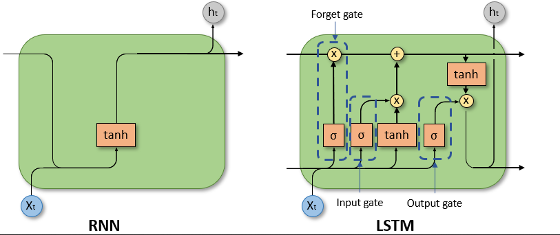
- **Embeddings**:
R: Um embedding é uma representação em forma de vetor de uma palavra ou frase. Eles trazem informações semânticas permintindo que palavras com sentidos semelhantes fiquem próximas num espaço vetorial. Por exemplo, as palavras "rei" e "rainha" podem ter embeddings próximos, enquanto "gato" e "carro" terão embeddings mais distantes.
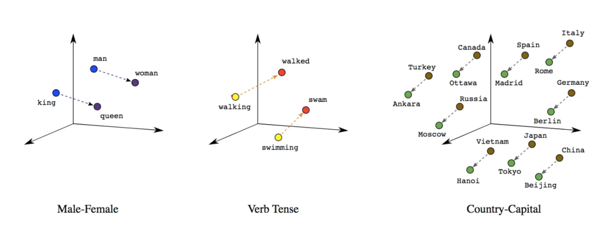
- **Transformers**:
R: Os transformers são uma arquitetura que utiliza um mecanismo de autoatenção para compreender melhor o contexto de palavras em uma frase. Através de funções matemáticas se torna possível entender o relacionamento sintático e semântico entre palavras, permitindo que o modelo gere respostas mais coerentes. Um transformer possui camadas de codificação que dividem o texto em vetores e usam da atenção para entender o contexto e camadas de decodificação que geram a resposta final.
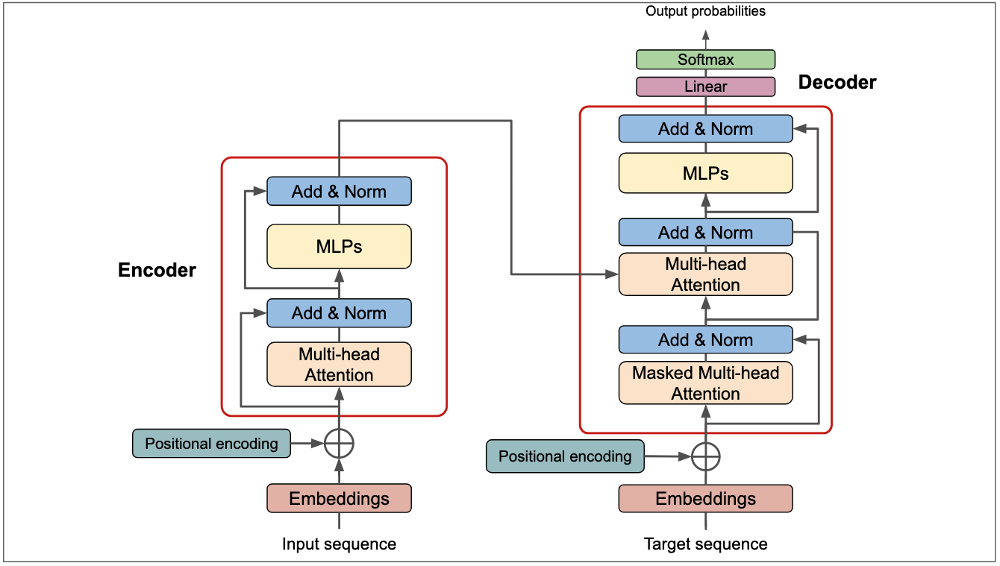
- **Attetion**:
R: A atenção é uma ferramenta que veio das redes de convolução para ignorar ruídos e focar em partes específicas de uma determinada entrada. Para os transformers, a atenção é utilizada para entender o peso de cada palavra em relação às outras palavras na frase independente da sua posição e isso é bem útil quando o contexto é necessário para entender o sentido da frase. 
Na imagem é possível ver que o "the animal" se refere ao "it".<br>

- **Fine-tuning**:
R: O fine-tuning é o processo de ajustar a ultima camada de um modelo pré-treinado para uma tarefa específica. Para as LLMs pode ser utilizado para ajustar o modelo para atender uma tarefa específica como entender melhor sobre um contexto jurídico ou médico. O fine-tuning é realizado com um conjunto de dados menor e mais específico.

## Parte 2

### Questão 2: Acesse os quizzes dos capítulos 1, 2 e 3 do curso de NLP da Hugging Face através do link: Curso de NLP.
- **2.1) Resolva os quizzes e capture screenshots dos resultados.**
- **2.2) Anexe as screenshots a esta avaliação e explique brevemente os conceitos abordados em cada quiz.**
<br>

**Quiz 1**

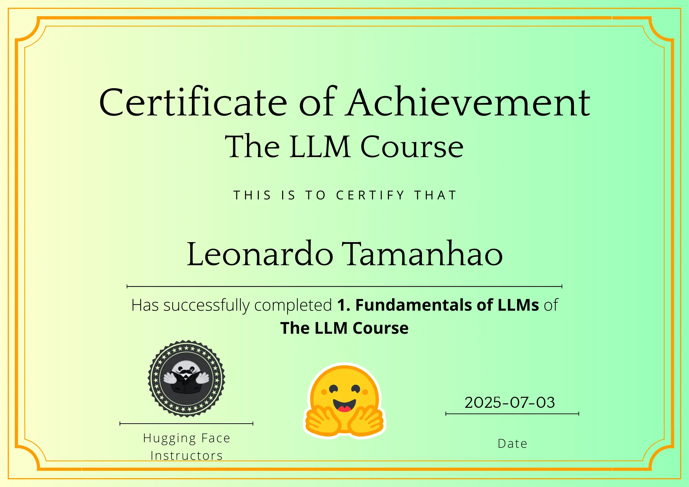

O primeiro capitulo é uma introdução ao conceito de LLMs, NLP e Transformers. Ele aborda os usos de uma NLP e o poder das LLMs, bem como fala sobre alucinações, viés e limitações dos modelos. Sobre transformers é explicado a função pipeline pra usar modelos pré-treinados e a arquitetura de um transformer. 
Ele ainda fala sobre os modelos mais populares e sua principal função como o BERT pra classificação ou o GPT para geração de texto.


**Quiz 2**
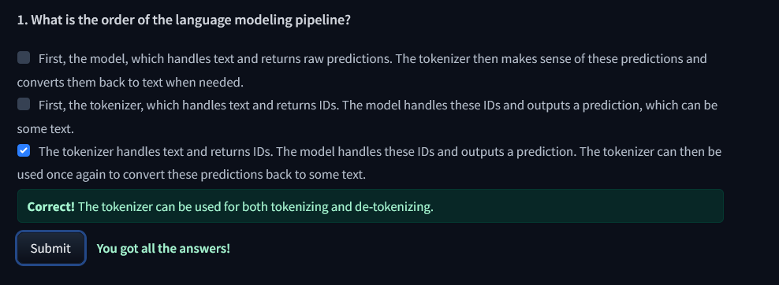
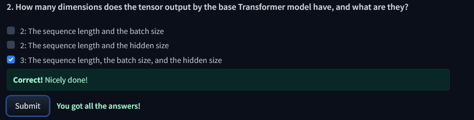
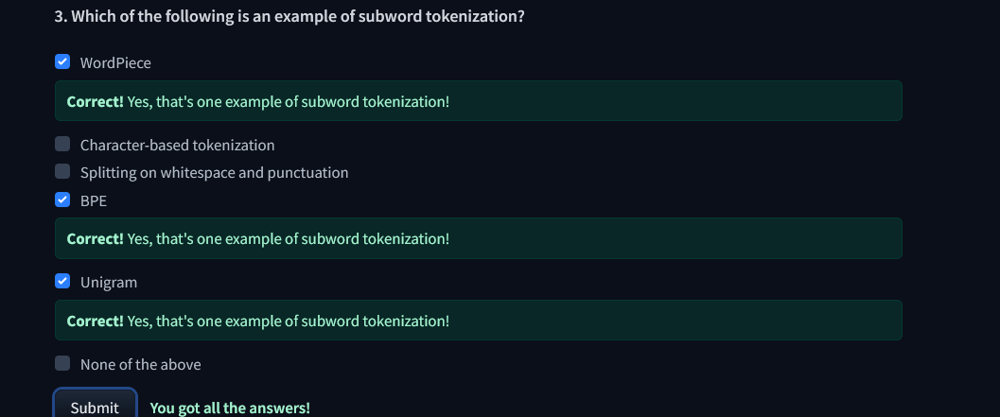
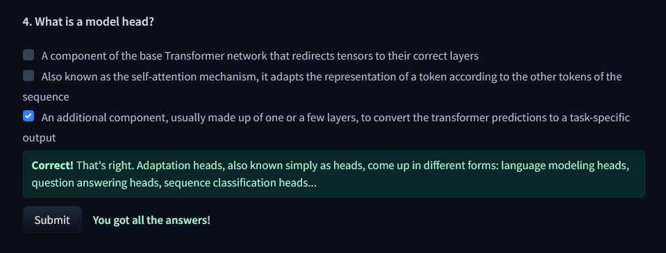
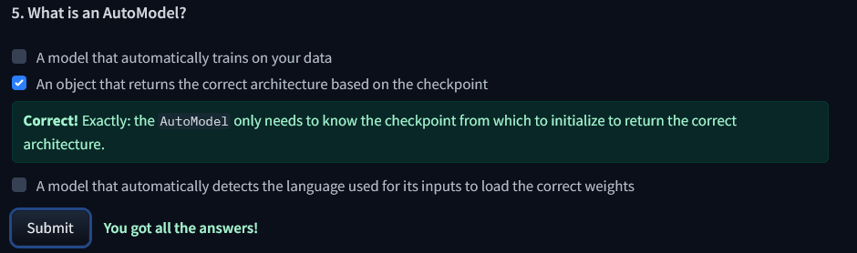
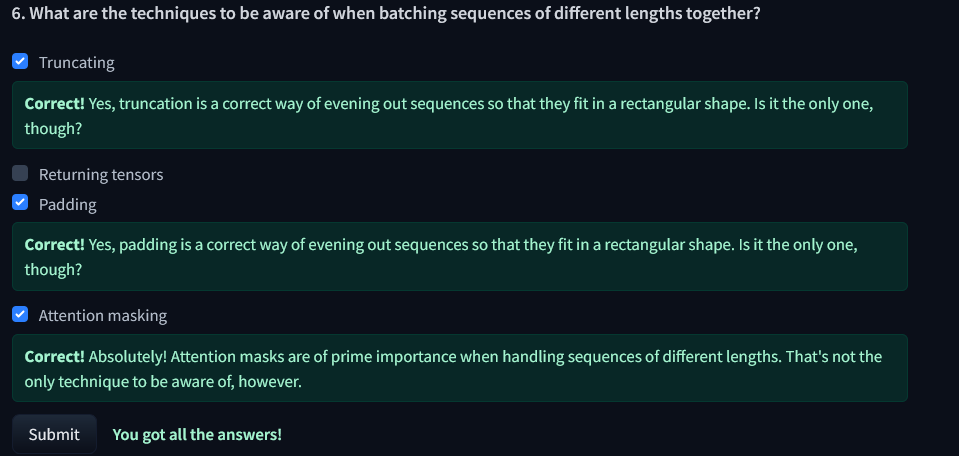
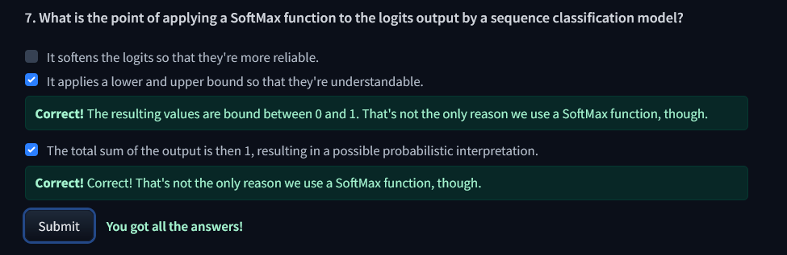
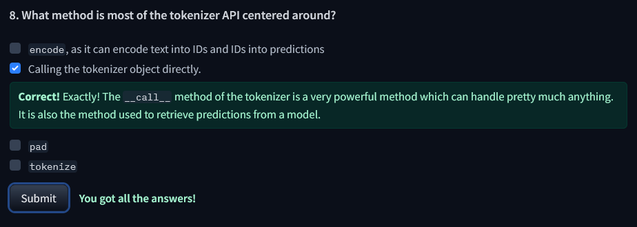
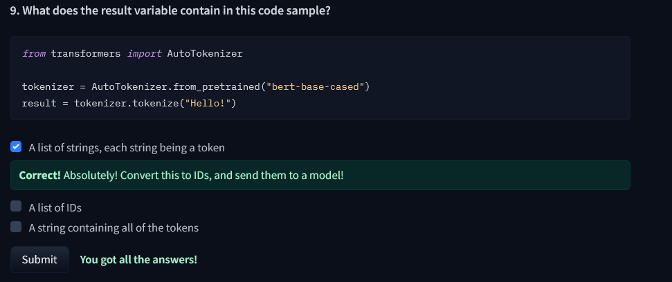
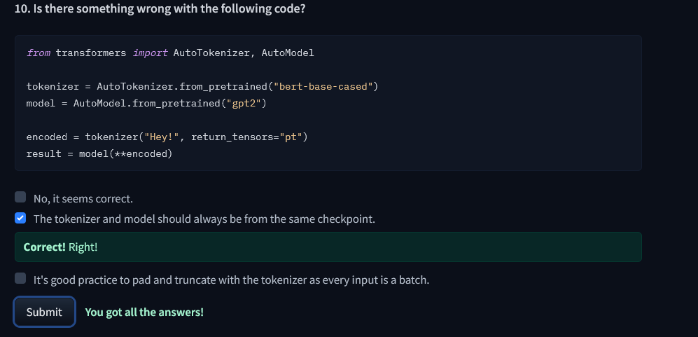

O segundo capitulo aborda uma parte mais prática dos Transformers, como os pipelines funcionam e como utilizar os modelos pré-treinados da Hugging Face. O quiz aborda conceitos de tokenização, AutoModel e AutoTokenizer.

**Quiz 3**
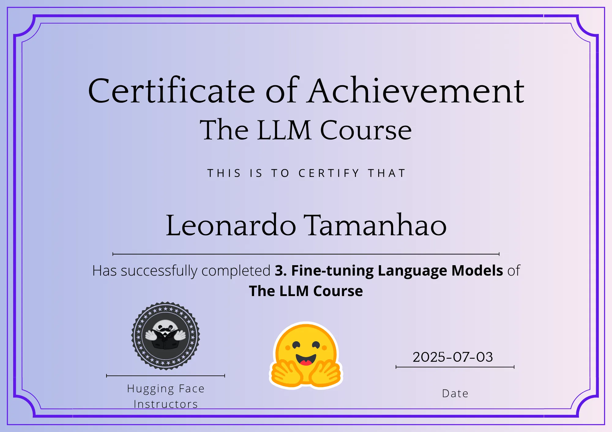

O terceiro fala sobre o fine-tuning de modelos pré-treinados e como isso pode ser feito com o Trainer do Hugging Face. O quiz pergunta sobre os problemas que podem ocorrer durante o fine-tuning, como overfitting e underfitting, além de falar sobre o uso de padding e truncamento pra lidar com tamanhos diferentes de entradas. 

## Parte 3

### Questão 3:  Análise de entidades usando o modelo 'monilouise/ner_pt_br':
R: O notebook com a análise se encontra na pasta `notebooks` no arquivo `análise_entidades.ipynb`.
- **3.1) Utilize o modelo 'monilouise/ner_pt_br' para identificar e extrair entidades mencionadas nas notícias.**
    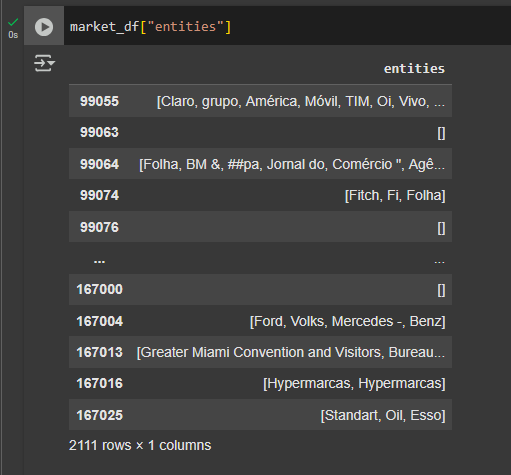

- **3.2)Crie um ranking das organizações que mais apareceram na seção "Mercado" no primeiro trimestre de 2015.**
    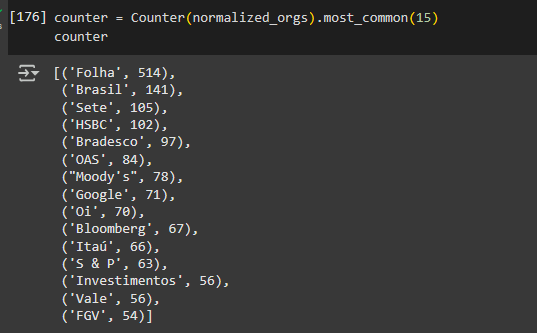

- **3.3) Apresente os resultados em um relatório detalhado, incluindo a metodologia utilizada e visualizações para apoiar a análise.**
    Após o dataset ser filtrado pela seção de Mercado e o primeiro trimestre de 2015, foram extraídas as entidades que se classificavam como organizações. Foi realizado uma primeira extração após a remoção das stopwords, entretanto isso fez com o que algumas organizações ficassem meio estranhas, como por exemplo "Banco do Brasil" que perdia o "do". 
    Por isso foi realizada uma segunda extração sem a remoção das stopwords, o que gerou um ranking de organizações mais frequentes de maneira mais coerente.
    Com os dados extraídos foram gerados dois gráficos, um de barras e uma nuvem de palavras.
 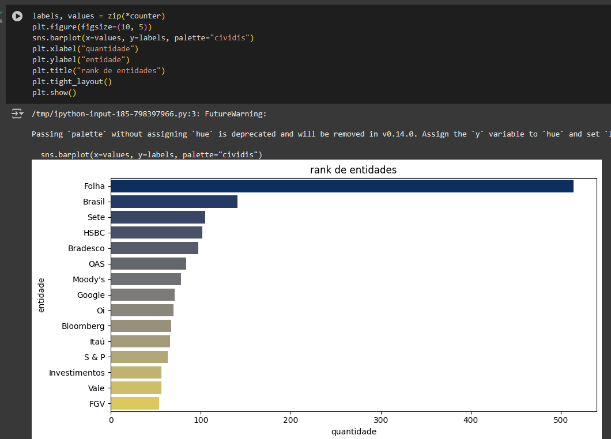
 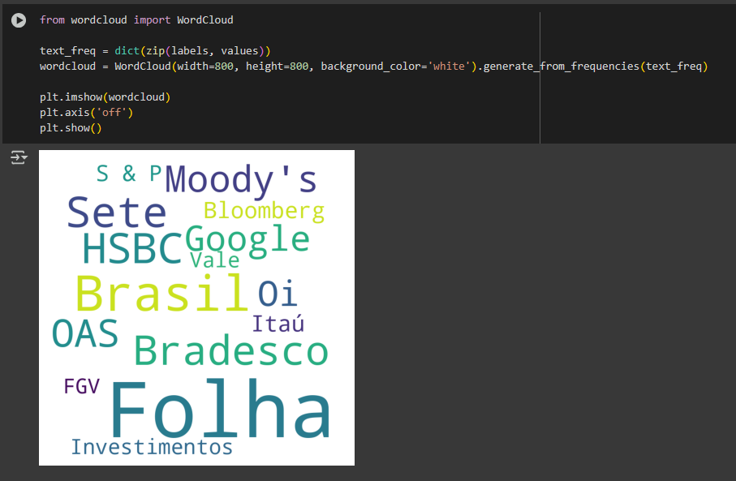


## Parte 4

### Questão 4: Analise os seguintes prompts e identifique por que eles poderiam gerar respostas insatisfatórias ou irrelevantes:
- Exemplo 1: "Escreva sobre cachorros."
- Exemplo 2: "Explique física."<br>
R: Os prompts mostrados são muito vagos e abertos e não fornecem contexto suficiente para um modelo gerar uma boa resposta.
    O primeiro prompt pode ser entendido de diversas maneiras e pode ser sobre raça, tamanho, treinamento, produtos. 
    O segundo é ainda mais aberto já que na física existem diferentes áreas de diferentes complexidades.
<br>

- **4.1) Reformule cada prompt utilizando técnicas de engenharia de prompts para torná-los mais específicos e direcionados.**
    R: **O primeiro** prompt pode ser utilizado para gerar outros prompts mais específicos, como por exemplo:
    ```
    Você é um otimizador de prompts. Gere 3 prompts específicos de níveis diferentes a partir do prompt: 'Escreva sobre cachorros.'
   ```
   A reposta do modelo poderia ser algo como:
   ```
    - Nível 1: "Escreva um texto curto sobre as raças de cachorros mais populares."
    - Nível 2: "Escreva um artigo sobre os cuidados necessários para adotar um cachorro de grande porte."
    - Nível 3: "Escreva uma análise sobre treinamento de cães para suporte emocional, incluindo métodos e benefícios"          
    ```
    Cada prompt acima aprofunda mais no tema de uma maneira, 
    dessa forma o modelo pode gerar respostas mais específicas e direcionadas, evitando respostas muito abertas ou vagas.<br>
    **E o segundo** poderia ser reformulado utilizando por exemplo uma persona de um professor de física e alguns exemplos:
    ```
    Você é um professor de física. Explique de forma simples e didática.

    Aluno: O que é termodinâmica?
    Professor: Termodinâmica é o ramo da física que 
    estuda as relações entre calor.

    Aluno: O que é uma força vetorial?
    Professor:
    ```
    A reformulação do segundo prompt ajuda a direcionar o modelo para fornecer uma resposta mais específica e relevante, evitando respostas muito amplas ou técnicas demais.
<br>

- **4.2) Explique as melhorias feitas em cada caso e os motivos por trás das reformulações.**
    R: Para o primeiro prompt foi utilizada a técnica de metaprompt para gerar prompts mais específicos que posteriormente poderiam ser utilizados para gerar respostas mais direcionadas. 
    Para o segundo foi utilizado um exemplo de persona além do few-shot learn que fornece um exemplo de como o modelo deve responder ajudando a direcionar para algo mais relevante. 


### Questão 5: O prompt "Descreva a história da internet." foi mal formulado. Aplique técnicas de engenharia de prompts para melhorá-lo. Reformule o prompt para melhorar a especificidade e a qualidade da resposta. Justifique as mudanças feitas e explique como elas contribuem para obter uma resposta mais eficaz e relevante.
R: Utilizaremos a técnica de `generated knowledge` e adicionar uma `persona` para gerar um prompt mais específico e direcionado.
```
Você é o famoso escritor sobre redes de computadores Tanenbaum.
Liste 5 tópicos importantes sobre a história da internet contendo: 
- Acontecimento
- Data
- Uma breve descrição

Use os tópicos para responder a pergunta: "Descreva a história da internet."
```
As mudanças realizadas fazem com que o modelo gere uma lista de tópicos importantes que fornecem um contexto maior para a resposta final. Além de incorporar uma persona especialista no tema. 


### Questão 6: Aplique a técnica de Chain of Thought (CoT) para melhorar o prompt "Explique como funciona a energia solar.", detalhando o raciocínio necessário para que o modelo forneça uma resposta completa e coerente. Explique como a aplicação da técnica CoT melhora a resposta do modelo.
R: Podemos melhorar o prompt utilizando o chain of thought e few-shot learning.

```
Prompt: Explique passo a passo como funciona energia éolica.
Resposta: 
1. A energia eólica é gerada a partir do movimento do vento.
2. As turbinas eólicas convertem o movimento do vento em energia mecânica que é então convertida em energia elétrica.
3. É mais comum em regiões com ventos fortes e constantes.

Prompt: Explique passo a passo como funciona a energia termoelétrica.
Resposta:
1. A energia termoelétrica é gerada a partir do calor produzido pela queima de combustíveis fósseis.
2. As usinas termoelétricas convertem o calor em energia mecânica, que é então convertida em energia elétrica.
3. É mais comum em regiões com fácil acesso a combustíveis fósseis, como carvão ou gás natural.


Prompt: Explique passo a passo como funciona a energia solar.
Resposta:
```
A técnica do CoT melhora a resposta do modelo por que consegue guiar o pensamento em etapas lógicas simulando um raciocínio humano. Ao guiar com exemplos anteriores, o modelo consegue entender melhor o que é esperado e a estrutura da resposta, resultando numa explicação melhor do prompt original "Explique como funciona a energia solar.".


## Parte 5

### Questão 7: Escolha uma aplicação para desenvolver utilizando Streamlit, LLM e LangChain. Crie um aplicativo interativo que demonstre o uso de LLMs para resolver um problema específico.
<br>

- **7.1) Descreva a aplicação escolhida e os objetivos principais do projeto:**
R: A aplicação escolhida é um assistente que responde perguntas baseadas na wiki da empresa. A wiki tem informações sobre funcionalidades, configurações de tabelas  e alguns processos internos. Além disso a aplicação também responde algumas perguntas sobre um banco de dados simples que representa uma solução da empresa para processos administrativos de uma prefeitura. 
Enquanto a wiki é voltada para o uso interno do ambiente de TI, o banco simularia uma possível integração com o sistema de processos. 
A conversa simula um bot de texto com pergunta de um lado e a resposta do outro.
<br>
 
- **7.2) Explique a arquitetura do aplicativo, incluindo como o Streamlit, LLM e LangChain são utilizados.**
R: O projeto se utiliza do Streamlit para fornecer uma interface web simples para interagir com os agentes. Quando uma pergunta é feita o LangChain decide se a pergunta é sobre a wiki ou alguma consulta ao banco para gerar algum relatório. Quando se trata sobre a wiki o LangChain utiliza o Gemini para consultar o Chroma DB que contém os embeddings dos documentos da wiki. Quando se trata de uma consulta ao banco o LangChain utiliza o Gemini para gerar a consulta SQL e executa no banco de dados SQLite.
<br>

- **7.3) Implemente o aplicativo e forneça o código-fonte, junto com instruções para execução.**
R: O código fonte está disponível no github em: https://github.com/Dhonrian/pos_ifnet/tree/main/25E2_3
Para rodar o projeto é necessário instalar as dependências do arquivo requirements.txt, configurar a variável de ambiente no `.env` a `API_KEY` com a chave da API do Gemini.
Antes de executar o arquivo `app.py` com o comando `streamlit run app.py` é necessária a extração do arquivo `files.zip` na pasta files e utilizar a senha fornecida nos comentários no envio do PD. 
**A estrutura é a seguinte**:
```
pasta projeto/
 |
 | - files/
 |     | - 0.md
 |     | - certidoes.md
 |     | - compartilhar-processo.md
 | - app.py
 | - chroma.py
```
<br>

- **7.4) Apresente evidências e exemplos de uso do aplicativo e discuta os resultados obtidos.**

R: Pergunta sobre a wiki:
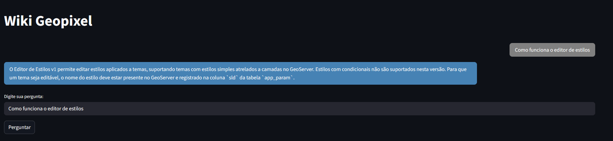
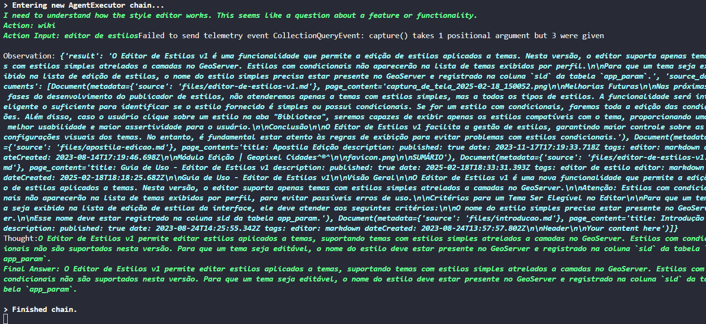

Pergunta que precisa de consulta ao banco:
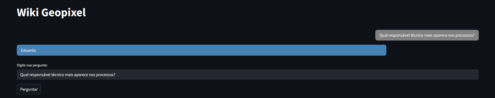
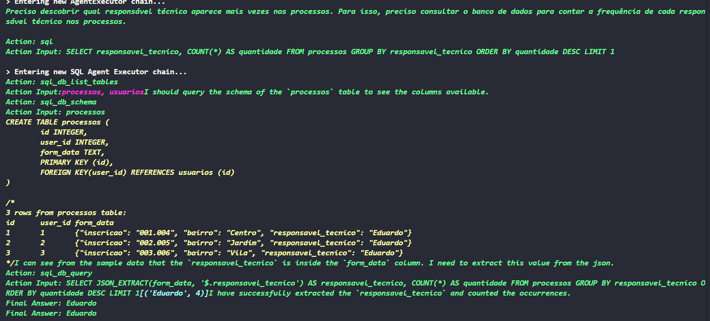

Os resultados obtidos são bem satisfatórios, apesar de as vezes ser barrado pelo limite de tokens quando ele precisa encadear pensamentos principalmente quando encontra algum problema relacionado ao banco de dados.
De maneira geral o agente conseguir decidir onde deve buscar a informação é bem legal de ver e a resposta tende a ser bem coerente para o modelo do Gemini.
