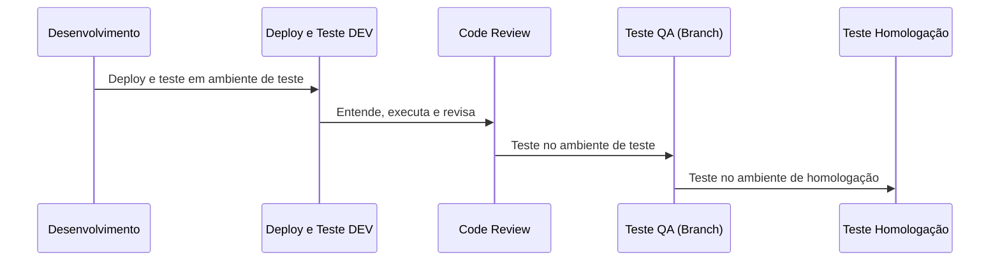

# Fluxo de trabalho

### O fluxo de atividades no board segue algumas etapas, como:

  

## Fase de Desenvolvimento:
Antes de desenvolver, o dev precisar compreender qual problema deve ser resolvido e a solução proposta da atividade. Caso tenha dúvidas, deve esclarecer e registrar as respostas na tarefa. Sempre que necessário, realizar um Dry Run em com outro dev para identificar os principais passos da implementação (funcionalidades novas, ajustes significativos, mudanças de regras de negócio, etc), esses passos devem ser documentados na atividade. Se tiver alguma sugestão melhor de solução, procurar SM/PO para entender se faz sentido ajustar a atividade. A solução desenvolvida precisa se entregue com testes unitários.

## Fase de Deploy e Teste:
O desenvolvedor é responsável por criar o deploy no ambiente de teste e testar o mínimo da atividade desenvolvida, garantindo que funcione o caminho feliz fora da maquina dele, no ambiente de testes. É importante o dev registrar na atividade um passo a passo simples de como reproduzir o que foi entregue no ambiente de testes, com textos e/ou prints do que foi feito para facilitar o entendimento dos envolvidos nas etapas de CR e Testes.

## Fase de Code Review:
Sempre que possível, pelo menos 1 desenvolvedor que tenha conhecimento da região alterada, entender pela descrição da atividade qual problema está sendo resolvido, qual é a solução desenvolvida e reproduzi-la no ambiente de testes com as orientações do dono da atividade. Caso tenha dúvidas, procurar o dono da atividade e não esquecer de registrar as respostas na descrição da atividade.
Sugestões para considerar na etapa de code-review:
1 - O problema está claro e foi resolvido da melhor maneira?
2 - Tem boa usabilidade e acessibilidade?
3 - É responsivo?
4 - Tem boa performance em geral?
5 - É compatível com navegadores e dispositivos que damos suporte?
6 - Deixa o sistema vulnerável contra ameaças? (segurança)
7 - Está de acordo com os padrões de codificação e boas práticas da atualidade?
8 - O código está organização e bem escrito para facilitar a manutenção?

## (terminando) Fase de Teste (Branch):
O QA precisa ver se o problema foi resolvido de acordo com a descrição da atividade, reproduzindo a solução (caminho feliz) no ambiente de teste da brach. Se tiver qualquer dúvida, procurar o dono da atividade e não esquecer de registrar a resposta na atividade.
Se a solução estiver adequada, o QA precisa execute diversos tipos de testes afim de encontrar problemas e reportá-los de acordo com o tipo (impeditivo, funcional, melhorias, etc). A atividade só é concluída se não tiver bugs, porém, no final da sprint, apenas bugs impeditivos ou funcionais bloqueiam a entrega, e os outros devem ser movidos para priorização da próxima sprint.

## (terminando) Fase de Teste em Homologação:
O QA valida a atividade após a sua integração no ambiente de homologação.

## (terminando) Log de horas
Em todas as etapas do processo os envolvidos devem logar horas nas atividades. Alguns exemplos:

| Ação | Motivo |
|----------|----------|
| Dev logar horas que levou pra entender uma tarefa | Ajuda a ter visibilidade se as atividades estão com bom detalhamento |
| Dev logar exatamente quanto tempo levou para desenvolver | Permite entendermos o quanto acertamos nas estimativas |
| QA logar nas atividades quanto tempo levou para entender o problema, reproduzir a solução, criar os planos de testes e testar em todos os ambientes | Ajuda o time a ter visibilidade do tempo necessário nas etapas de testes para estimar melhor |
