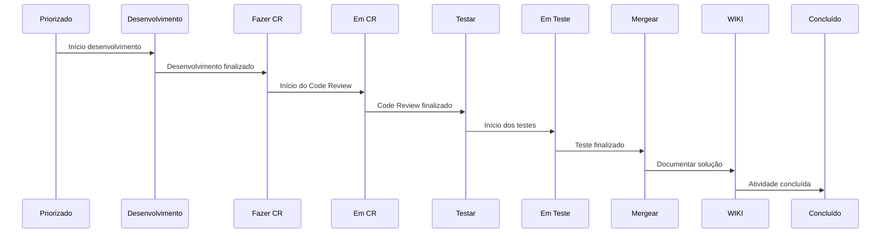

# Fluxo de trabalho

O fluxo de atividades no board é dividido em etapas bem definidas, como:

1.  **Priorizado**: Essa é a etapa inicial do fluxo, onde todas as tarefas planejadas na sprint são listadas. As tarefas aqui ainda não estão em andamento.
    
2.  **Desenvolvimento**: Quando um membro da equipe começa a trabalhar em uma tarefa, ela é movida para essa etapa. Isso reflete que o trabalho está em andamento.

	2.1 Utilizar o banco de desenvolvimento.
  2.2 Gerar um deploy para a branch desenvolvida (banco compartilhado homolog). Realiza o teste no link deployado. 
  2.3 
    
3.  **Fazer CR**: Após a conclusão de uma tarefa, ela pode ser movida para esta etapa para revisão por outros membros da equipe, garantindo qualidade e consistência.
    
4.  **Em CR**: Quando um membro da equipe começa a revisar uma tarefa, ela é movida para essa etapa. Isso reflete que o trabalho está em andamento.
    
5.  **Testar**: Tarefas que foram revisadas e aprovadas estão prontas para serem testadas. 

6. **Em teste**: Quando um membro da equipe começa a testar uma tarefa, ela é movida para essa etapa. Isso reflete que o trabalho está em andamento.

7. **Mergear**: Tarefas que foram testadas e aprovadas estão prontas para serem mergeadas.

8. **WIKI**: Tarefas que foram mergeadas estão prontas para serem documentadas na WIKI https://wiki.flow.geopixel.com.br/.

8. **Done**: Tarefas que foram mergeadas e documentadas estão prontas para serem consideradas como concluídas.

